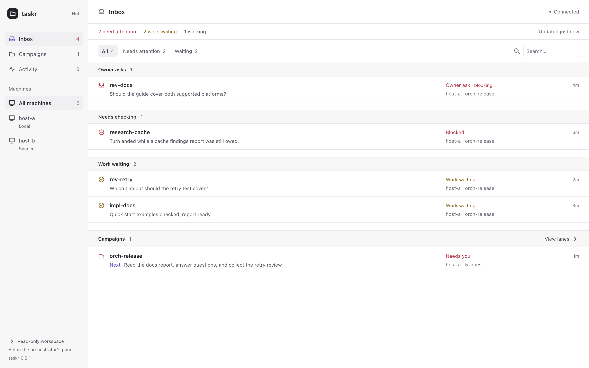
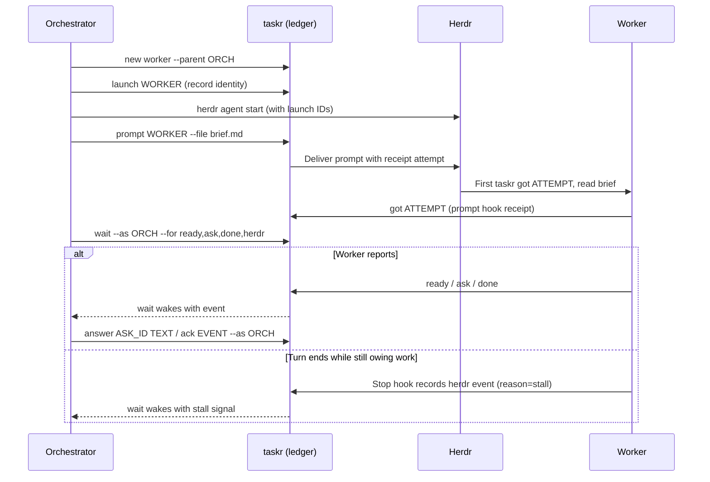

# taskr

taskr is a task ledger and a blocking `wait` for orchestrator agents that delegate
work to workers in [Herdr](https://herdr.dev) panes. It ships as a Go binary,
stores coordination state in SQLite, and includes a read-only dashboard.
Herdr runs your agents; taskr tracks their questions, reports, and progress.

<picture>
  <source media="(prefers-color-scheme: dark)" srcset="docs/img/dashboard-dark.png">
  
</picture>

Mock data.

## Why use it?

Keep parallel work moving without polling terminal screens or relaying messages:

- Register lanes with brief and report paths.
- Keep the text of briefs, prompts, reports, and handovers in the ledger, with a goal and a plan for each campaign.
- Block on `wait` until a report, question, or event arrives.
- Confirm prompt acknowledgment with receipts.
- Answer worker questions and route owner decisions.
- Catch turns that stop while work is owed, using optional hooks.
- Scan questions, campaign progress, and activity in the dashboard.
- Coordinate across machines with an optional Tailscale hub.
- Skip taskr if you run one agent at a time or do not use Herdr.

Agents still do the work and write reports to files. Receipts confirm
acknowledgment; stall signals prompt investigation rather than proving failure.

## How it works

Herdr runs the agents; taskr records coordination state and wakes the orchestrator.
Hook receipts and stall signals require the optional agent hooks.



## Install

Paste this into Claude Code or Codex running inside Herdr:

```text
Install taskr for Herdr: fetch https://raw.githubusercontent.com/olafurns7/herdr-taskr/master/docs/install.md and follow it step by step. Ask me before changing any hook or agent settings.
```

Prefer to do it by hand? The [runbook](docs/install.md) is plain shell.

## Status and license

Early software; interfaces and install details may change.
Licensed under [MIT](LICENSE).
Source: [olafurns7/herdr-taskr](https://github.com/olafurns7/herdr-taskr).
