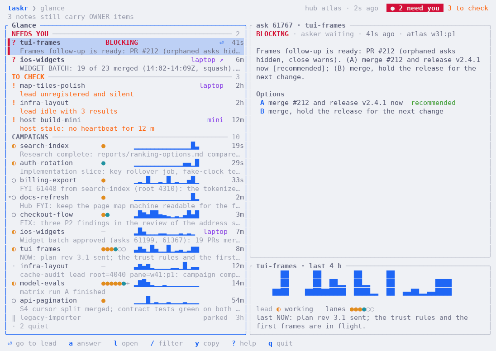

# taskr

taskr is a task ledger and hub for agent fleets running in
[Herdr](https://herdr.dev). Orchestrator agents register their workers in it,
workers report progress and ask questions through it, and you, the owner, see
at a glance what needs you.

- **For agents:** a `taskr` command line that records briefs, reports,
  questions, answers and decisions, and a blocking `wait` that wakes the
  orchestrator when something arrives.
- **For you:** `taskr-tui`, a terminal view of every campaign, with the open
  questions first.
- **Across machines:** one host keeps the ledger (the taskr hub); the others
  send their commands to it over Tailscale.

The Rust hub daemon can check in with idle leads when started with
`TASKR_CHECKIN=1`; it is off by default. See [the daemon guide](docs/daemon.md).

Skip taskr if you run one agent at a time or do not use Herdr.

<picture>
  <source media="(prefers-color-scheme: dark)" srcset="docs/images/glance-dark.png">
  
</picture>

Open a campaign to see its goal, plan, lanes, questions, documents and log:

<picture>
  <source media="(prefers-color-scheme: dark)" srcset="docs/images/campaign-dark.png">
  
</picture>

The screenshots show invented data (`taskr-tui --demo`).

## Install

Paste this into Claude Code or Codex running inside Herdr:

```text
Install taskr for Herdr: fetch https://raw.githubusercontent.com/olafurns7/herdr-taskr/master/docs/install.md and follow it step by step. Ask me before changing any hook or agent settings.
```

Or install by hand on macOS or Linux:

```sh
curl -fsSL -o taskr-install.sh \
  https://github.com/olafurns7/herdr-taskr/releases/latest/download/install.sh &&
  test -s taskr-install.sh &&
  TASKR_LINK_SKILLS=1 sh taskr-install.sh &&
  PATH="$HOME/.local/bin:$PATH" taskr version
rm taskr-install.sh
```

This installs the `taskr` binary, the agent skill and the Herdr plugin. The
[install guide](docs/install.md) has every step, including more than one
machine.

## Start the terminal view

`taskr-tui` has no prebuilt download yet (one is planned). Build it from a
clone of this repository with [Rust](https://rustup.rs):

```sh
cargo install --path crates/taskr-tui
```

Then:

```sh
taskr-tui --demo   # invented data; reads no ledger and writes nothing
taskr-tui          # your ledger
```

Press `?` for the keys and `q` to quit. [docs/tui.md](docs/tui.md) explains
the screens.

## Documentation

| Page | What it covers |
| --- | --- |
| [docs/install.md](docs/install.md) | Installing, upgrading, hooks, several machines, uninstalling |
| [docs/tui.md](docs/tui.md) | `taskr-tui`: screens, keys, colours and marks |
| [docs/cli.md](docs/cli.md) | The `taskr` commands agents run, and how a campaign flows |
| [docs/daemon.md](docs/daemon.md) | The daemon, the taskr hub, client hosts and how they find each other |
| [docs/release.md](docs/release.md) | Building and publishing a release |
| [docs/troubleshooting.md](docs/troubleshooting.md) | Common problems and what to check |

Agents read [SKILL.md](SKILL.md) and [references/](references/) instead; the
installer puts them where agents load skills from.

## Status and license

Early software; interfaces and install details may change.
Licensed under [MIT](LICENSE).
Source: [olafurns7/herdr-taskr](https://github.com/olafurns7/herdr-taskr).
