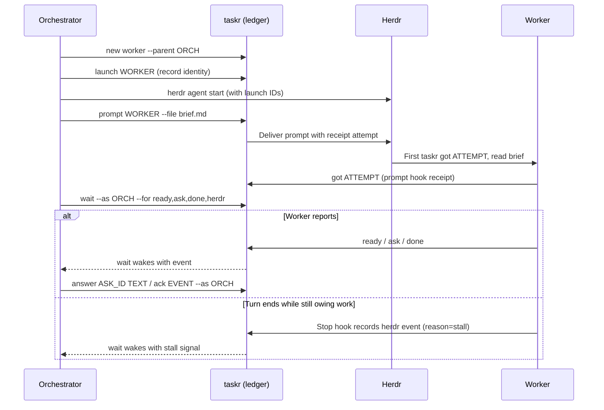

# taskr

taskr is a task ledger and a blocking `wait` for orchestrator agents that delegate
work to workers in [Herdr](https://herdr.dev) panes. It ships as a Go binary,
stores coordination state in SQLite, and includes a read-only dashboard.
Herdr runs your agents; taskr tracks their questions, reports, and progress.

<picture>
  <source media="(prefers-color-scheme: dark)" srcset="docs/img/dashboard-dark.png">
  
</picture>

Mock data.

## Why use it?

Keep parallel work moving without polling terminal screens or relaying messages:

- Register lanes with brief and report paths.
- Keep the text of briefs, prompts, reports, and handovers in the ledger, with a goal and a plan for each campaign.
- Capture files from any host without copying them to the ledger host.
- Queue client records during an outage for the daemon to send later.
- Search captured documents, decisions, questions, answers, and notes.
- Label closed lanes accepted, reworked, rejected, or abandoned.
- Block on `wait` until a report, question, or event arrives.
- Confirm prompt acknowledgment with receipts.
- Answer worker questions and route owner decisions.
- Catch turns that stop while work is owed, using optional hooks.
- Scan questions, campaign progress, and activity in the dashboard.
- Coordinate across machines with an optional Tailscale hub.
- Skip taskr if you run one agent at a time or do not use Herdr.

Agents still do the work and write reports to files. Receipts confirm
acknowledgment; stall signals prompt investigation rather than proving failure.

## How it works

Herdr runs the agents; taskr records coordination state and wakes the orchestrator.
Hook receipts and stall signals require the optional agent hooks.

The daemon publishes `taskr_state` and `taskr_round` on server-host panes.
Every host's daemon publishes `taskr_owner_ask=<n>` on its own panes while
that pane's own task has n unanswered owner asks (cleared at 0 or when the
task closes); a client host gets the counts in the server's observation reply.
On each host, each task workspace gets `taskr_campaign`, the campaign's
name; it also gets `taskr_parent`, the ID of the workspace of the campaign's
orchestrator, when that orchestrator's pane is open on the same host.
The orchestrator's own workspace gets neither token. A sidebar plugin can
use these tokens to group task workspaces by campaign.
Client daemons publish these workspace tokens from the server's observation
reply. An older or unreachable server leaves the client's tokens unchanged.



### Owner glance

`taskr glance` prints the owner's snapshot as one `j1` JSON line.
`taskr glance --watch [--every 5s]` is a live view for a narrow split pane
that works on the hub and on client hosts; q quits.
The verdicts are **no owner action**, **N need you**, and **N to check**.
Red means an open owner ask, blocking or non-blocking. Sound notifications
fire only for blocking owner asks; pane badges count all owner asks.
Notes are context, with the newest owner note and its age on the campaign.
A dim **N notes still carry OWNER items** count tracks notes awaiting
conversion to asks. `note --owner` warns when an OWNER item has no open ask.

Park a campaign with `taskr set ROOT glance.state=parked`; clear it with
`taskr set ROOT glance.state=`. Only a root orchestrator with TASKR_TASK unset
can set this root ref. Parked campaigns stay dim and keep owner asks red;
new tree events after parking turn the row amber as **parked but active**.

Amber marks visibility gaps, active registered leads gone/blocked/unknown,
idle or done leads without a live wait lease holding results older than
30 minutes, and unregistered leads silent for 2 hours with lanes open.
Live wait leases read **waiting**. Lane trouble and ordinary inbox backlog
remain in task detail rather than the owner's alarm list.

## Install

Paste this into Claude Code or Codex running inside Herdr:

```text
Install taskr for Herdr: fetch https://raw.githubusercontent.com/olafurns7/herdr-taskr/master/docs/install.md and follow it step by step. Ask me before changing any hook or agent settings.
```

Prefer to do it by hand? The [runbook](docs/install.md) is plain shell.

## Status and license

Early software; interfaces and install details may change.
Licensed under [MIT](LICENSE).
Source: [olafurns7/herdr-taskr](https://github.com/olafurns7/herdr-taskr).
