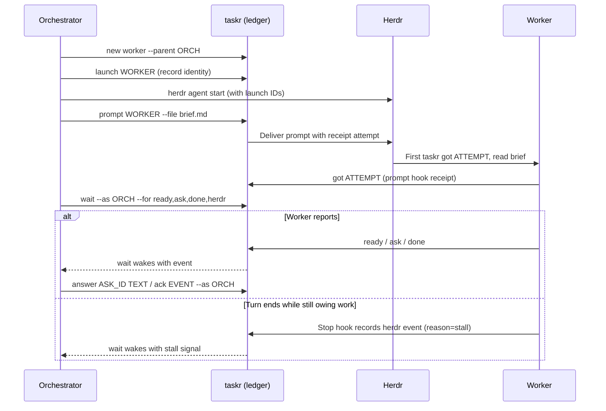

# The taskr command line

Agents run `taskr`; you rarely need to. This page explains what the commands
do so you can follow what your agents are doing and read the ledger yourself.
Agents get the same contract, in a denser form, from [SKILL.md](../SKILL.md)
and [references/](../references/).

`taskr help` prints every command; `taskr help CMD` explains one.

## The words

| Word | Meaning |
| --- | --- |
| Orchestrator | An agent that hands work to other agents. A root orchestrator has no parent. |
| Lane | One worker task under an orchestrator: an implementer, a reviewer, a researcher. |
| Campaign | A root orchestrator and all its lanes. |
| Ask | A question. An owner ask (`--owner`) is for you; `--blocking` means the work has stopped for the answer. |
| Launch | One start of an agent for a lane. A relaunch gets a new one, so an old agent's writes are refused. |
| Hub | The host that keeps the ledger. See [daemon.md](daemon.md). |

## How a campaign flows

Herdr runs the agents. taskr records what they tell each other and wakes the
orchestrator when something arrives, so nobody polls a terminal.



Agents still do the work and write their reports to files. A receipt means
the prompt was acknowledged, not that the work is done; a stall is a signal to
look, not proof of failure. Receipts from hooks and stall signals need the
optional [agent hooks](install.md#6-agent-hooks).

## What a worker runs

A worker's parent sets `TASKR_TASK` and `TASKR_LAUNCH` in its environment;
they say which lane is speaking.

```sh
taskr got ATTEMPT                      # "I received the prompt"
taskr note "progress"
taskr ready "slice done" --report PATH # a result the orchestrator should read
taskr ask "question" --blocking        # add --owner to ask you
taskr wait --for answer                # block until the answer arrives
taskr done "summary"                   # or: taskr fail "why"
```

## What an orchestrator runs

```sh
taskr new impl-api --role implementer --parent ROOT   # register a lane
taskr launch LANE --provider P --model M --effort E   # record an agent start
taskr prompt LANE --file brief.md                     # deliver the brief
taskr wait --as ROOT --for ready,ask,done,fail        # block until something arrives
taskr answer ASK_ID "text"                            # answer a question
taskr ack EVENT_ID --as ROOT                          # mark an event handled
taskr close LANE --outcome accepted                   # or reworked, rejected, abandoned
```

It also keeps the campaign's plan in the ledger:

| Command | Does |
| --- | --- |
| `doc set ROOT goal\|plan --file PATH` | Store the goal or the plan. |
| `next ID TEXT` | Record the next step for a task. |
| `decide --as ROOT TEXT` | Record a rule in force (`--revoke EVENT_ID` withdraws it). |
| `set ID KEY=VALUE` | Store a reference such as a branch or a PR number. `pr=31` or `pr=owner/repo#31` links a PR, which the hub follows when `watch.json` enables it ([PR events](daemon.md#pr-events)); `pr=` unlinks. A task holds at most 20 references; the poller's `pr.state` and `pr.ci` do not count toward them. `tmp.cleanup=on-close\|root-close\|keep` sets a root's tmp cleanup policy; it counts as one reference, and any other value or a non-root target exits 2. |
| `after TARGET --as ROOT [--on KINDS] [--keep]` | Subscribe the root to another tree's lane or a PR. TARGET is a task id (`--on` from `done`, `ready`, `closed`, `fail`; default `done,closed`) or `pr:owner/repo#N` (`pr:N` uses `watch.json`'s default repo; `--on` any PR sub; default `merged`). A match puts an `after` event (code `af`) in the root's inbox with data `target`, `on` and `source_event_id`; a filtered `wait` always returns it. It fires once unless `--keep`, which repeats until the root closes. Closing the root cancels its subscriptions. A PR target fires only for a PR some task links with `pr=`; the hub keeps polling it while the subscription is unfired, even after that task closes. Prints `af1 SUB_ID`. |
| `after --list --as ROOT`, `after --cancel SUB_ID` | List the root's subscriptions (one `j1` row each, with `fired_at`), or cancel one (`af1 SUB_ID cancelled`). |
| `close ID [--outcome accepted\|reworked\|rejected\|abandoned] [--clean-tmp]` | Close the task. `--clean-tmp` immediately removes this host's lane tmp dir (a root: the whole campaign, including open-lane dirs), regardless of policy, after confirmed closure. See [Lane tmp dirs](#lane-tmp-dirs). |
| `tmp ID [--mkdir]` | Print lane ID's own tmp dir, `<base>/<root-id>/<task-id>` (a root's own dir is `<base>/<root-id>/<root-id>`). `--mkdir` creates the base, campaign and lane dirs with mode 0700. See [Lane tmp dirs](#lane-tmp-dirs). |
| `handover --as ROOT`, `adopt ROOT` | Write a Markdown handover; let a new agent take the campaign over. |
| `note "OWNER: ..." --owner --as ROOT` | Leave a note for you. |
| `ask [TEXT] --owner --question JSON [--dialog] [--blocking] --as ROOT` | A structured owner ask: one AskUserQuestion-shaped object (`question`, 2-4 `options` with `label`, optional `description` and one `recommended`, optional `header` and `multiSelect`; `preview` is dropped; at most 4 KiB). The summary is built from it as `[header: ]question (A) label; (B) label`, with TEXT as context before it. `--dialog` marks a question relayed from the hub's dialog. Answers stay plain text. |

## Reading the ledger

These are safe to run yourself; they change nothing.

| Command | Shows |
| --- | --- |
| `taskr glance` | The owner snapshot `taskr-tui` draws, as one line of JSON. `--watch` is a plain live view for a narrow pane. |
| `taskr glance --brief [--since EVENT\|30m]` | The glance once, as plain text for the hub: owner asks with their ask and root ids, things to check, then one row per active campaign. `--since` takes the header's `cursor=` (or a duration) and hides campaigns with nothing new; asks and checks always show. |
| `taskr status [--tree ID] [--all]` | Tasks and their states. |
| `taskr asks --owner --open` | Questions waiting for you. |
| `taskr campaign ROOT [--all]` | One campaign: goal, plan, lanes, asks, decisions, documents, PR refs and a page of the log. |
| `taskr log ID [--tree]` | The events of a task or a whole tree. |
| `taskr notes --owner` | Notes left for you in the last 48 hours. |
| `taskr doc ls ID`, `taskr doc get DOC_ID` | Captured briefs, reports, goals and plans. |
| `taskr search QUERY` | Documents, decisions, asks, answers and notes. |
| `taskr slotr` | slotr's pools, holders and queue as the hub sees them, as JSON with the campaign root of each row's task; `{"available":false,"error":...}` when slotr cannot be read. It adds `available`, `host` and `now`, and exits 0 either way. Takes no arguments. |
| `taskr daemon --status` | The daemon on this host. See [daemon.md](daemon.md). |

To answer an owner ask without the TUI: `taskr answer ASK_ID "your answer"`.

## Output and exit codes

Output is compact by default, one tagged line per record, built for agents.
Add `--json` (or set `TASKR_FORMAT=json`) for plain JSON.

| Exit | Meaning |
| --- | --- |
| 0 | Success, or a `wait` that timed out. |
| 2 | Wrong usage. |
| 3 | Interrupted. |
| 4 | Database error. |
| 5 | Transport: the hub was unreachable or a prompt could not be delivered. The line says how to retry. |
| 6 | Refused: a stale launch, a closed task, the wrong host. Stop; do not retry. |

On a client host, the reports `got`, `ready`, `done`, `fail`, `decide`,
`next`, `note` and `close` print `qd1 <key>` and exit 0 when the hub cannot be
reached: they are queued and sent later, not lost. See
[troubleshooting.md](troubleshooting.md#a-command-printed-qd1).

## Lane tmp dirs

Each lane gets a tmp dir of its own, named from integer ids only:

```text
<base>/<root-id>/              the campaign dir
<base>/<root-id>/<task-id>/    a lane's dir (the root's own: <base>/<root-id>/<root-id>/)
```

The base is `$TASKR_TMP_BASE`, else `/tmp/taskr-<uid>`. `taskr tmp ID` prints the
lane dir: the bare path, or `{"root_id","task_id","tmpdir","cleanup"}` with `--json`.
Without `--mkdir` it touches nothing. With `--mkdir` it creates each missing dir
with mode 0700 and checks every one with lstat; it exits 1 when the base is
relative or any of the three is a symlink, not a directory, owned by another
user, or group- or world-writable. An unknown task exits 6.

The base must be a dedicated taskr directory, never HOME or a shared tmp/project
directory. `tmp ID --mkdir` also explicitly initializes its `.taskr-tmp` marker
(owned by the caller, regular file, mode 0600, content `taskr tmp base v1\n`).
Creation is exclusive and relative to a validated directory descriptor; an
existing marker is checked without following links or overwriting it. Cleanup
refuses a missing, symlinked or invalid marker. Existing T1 bases are initialized
only by an explicit `tmp ID --mkdir`; neither a daemon nor `--clean-tmp` marks them.
Before creating a marker or campaign/lane directories, `--mkdir` refuses any
existing base entry other than a valid marker or a safe canonical positive-integer
campaign directory whose root and lane membership the ledger confirms. Campaign
entries must likewise be safe canonical lane directories; lane contents are
preserved. This also applies to already marked bases. Numeric names alone do not
establish dedication. Unknown membership, failed hub reads, links, unsafe
directories and a preflight exceeding 4096 entries or 60 seconds refuse without
changing existing files, modes or marker bytes. Empty bases remain usable.

Automatic launcher initialization requires a release containing this guard.
The first guarded release is v0.18.0: launchers must accept v0.18.0 or later
releases and reject every earlier release (including all v0.17.x), `dev` and
unknown versions before `--mkdir`. The owner-held v0.18.0 release must be built
from a master commit containing the merged initializer guard; no reuse of staged
artifacts or old tags. A dev test artifact is not a release. `--json version` reports the build's `TASKR_VERSION`
(or `dev` when unset), not the Cargo package version.

The directory work is always on the host that runs the command. On a client
host, taskr asks the hub for the task's root and cleanup state (a read, not stored) and makes
the dir locally; the hub refuses a forwarded `tmp --mkdir`.

The compact `taskr launch` line (`l1`) adds `root_id` and `tmpdir`, the lane path
as computed on the host that runs the launch (the hub, for a client); it is
informational and creates nothing. The `--json` launch object is unchanged.

Set `taskr set ROOT tmp.cleanup=on-close|root-close|keep` on a root. Unset
means `on-close`: closed lanes are cleaned individually, then the entire
campaign once the root and every canonical lane entry are confirmed closed
past the grace. `root-close` retains all lanes until that same campaign check
passes; `keep` disables automatic cleanup. The policy counts toward the
20-reference limit. Empty or unknown values and non-root targets exit 2.
The `cleanup` JSON object contains `root_id`, `task_id`, `policy`, `closed`, `closed_at`
and `root_closed_at`; `closed` confirms task status. Timestamps are null for
open tasks/roots or legacy rows missing a close time. Sweeps require a valid
close time; explicit cleanup requires confirmed closed status.

Every host's daemon sweeps its own base every three minutes, after a
10-minute grace from the ledger's close timestamp. It ignores unknown ids,
open tasks, noncanonical integer directory names (including leading zeros)
and failed ledger reads. Before removing a whole campaign, it freshly checks
every canonical integer lane entry. Any open, unknown, mismatched, unconfirmed,
recent or malformed entry, or failed lookup, preserves the campaign. Eligible
known closed lanes may still be removed individually under `on-close`. Once the
whole campaign is authorized, extra files inside it also go. Client daemons read the hub; there is no
local-ledger fallback.

Each daemon also measures its local campaign dirs on that three-minute worker.
`glance --brief`, `status` and the TUI show `tmp 1.2G`: the sum of known hosts'
**last-reported logical file bytes**, using binary K/M/G units. This is neither an
instant measurement nor exact reclaimable disk space. Hard links count at each
file entry and sparse files count their logical length; symlink targets never
count. Missing/invalid reports stay unknown; a successfully measured empty dir
reports `tmp 0`. A removed dir retains its last report until updated or cleared.

Reports use root refs `tmp.bytes.<host>`, outside the ordinary 20-ref budget.
Only these valid bookkeeping keys may exceed 32 ASCII bytes: the nonempty
existing lowercase host label may have up to 63 bytes (73 including the prefix),
using `[a-z0-9_.-]`. A caller can update only its own host report, with unsigned
integer bytes. Ordinary keys keep their existing 32-byte limit and budget.
Hub daemons use the existing local host identity; clients use their verified RPC
identity. Invalid/fallback identities skip publication without inventing a host.
Unknown/mismatched roots or lane members, unsafe/unmarked bases, walk cutoffs
and filesystem/ledger errors keep the prior report. Measurement creates, marks
and deletes nothing. Closed roots are skipped before traversal and retain their
last report. Glance JSON includes `tmp` and `tmp_bytes`. Briefs append size after
the primary status; narrow TUI rows omit size when it would clip primary fields,
while the detail pane retains it. Campaign log pages and their counts omit size
telemetry; raw `taskr log` still includes it.

`taskr close ID --clean-tmp` skips the grace and policy after confirmed
closure. Explicit root cleanup removes all campaign tmp, including open-lane
dirs; it does not close those lanes. Clients forward only the close; cleanup runs locally after a fresh
hub identity/status read. An offline/queued close deletes nothing and warns
that immediate cleanup was skipped. The ordinary policy sweep waits for
confirmed closure and grace; `keep` and `root-close` may retain the lane.
When connectivity returns, rerun `close ID --clean-tmp`; an already-closed
task can still be cleaned. No filesystem path or cleanup intent is spooled.
A cleanup failure exits 1 and says the close succeeded; it does not undo the
ledger close.

Both cleanup paths recheck the normalized base: a real directory owned by
the caller, never group/world-writable, with a valid `.taskr-tmp` marker. Removal uses directory descriptors,
no-follow opens and unlinkat. Symlinks inside the tree are unlinked without
following their targets; symlinked campaign/lane directories are refused.
Directories on another device are refused. Filesystem errors are reported
and leave other sweep candidates eligible. Trees deeper than 128 directories
are refused rather than exhausting the stack.

## Environment

| Variable | Used for |
| --- | --- |
| `TASKR_TASK`, `TASKR_LAUNCH` | Which lane a worker is. Set by its parent; never replace them. |
| `TASKR_DB` | Use this ledger file, locally, even on a client host. Useful for experiments. |
| `TASKR_FORMAT=json` | JSON output. |
| `TASKR_TMP_BASE` | A dedicated taskr directory for lane tmp (default `/tmp/taskr-<uid>`), never HOME or a shared tmp/project directory. Absolute path; initialize its marker explicitly with `tmp ID --mkdir`. See [Lane tmp dirs](#lane-tmp-dirs). |
