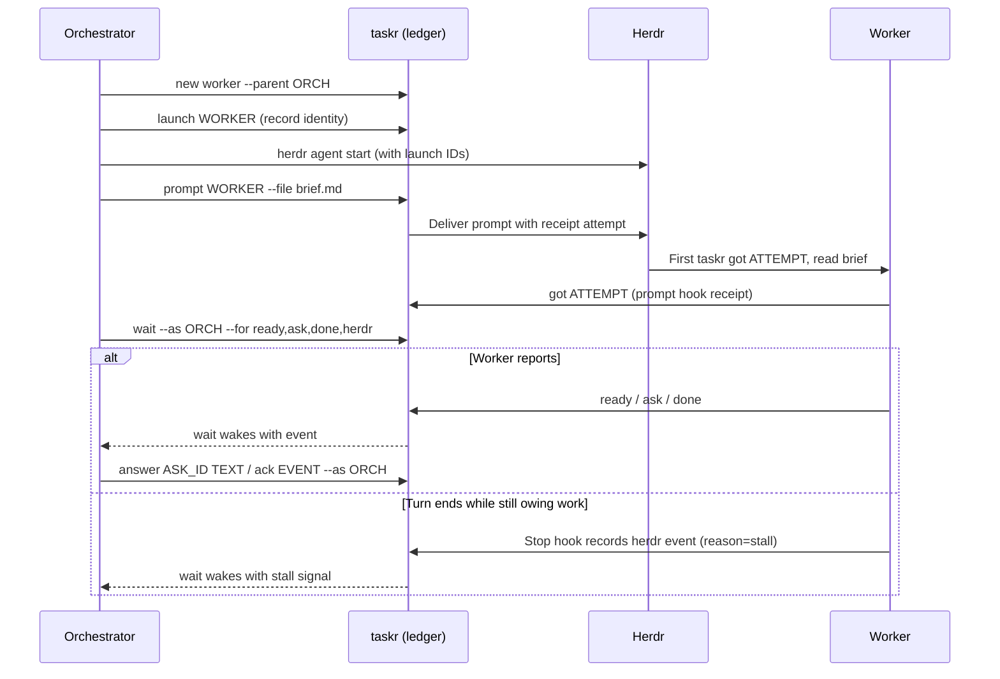

# The taskr command line

Agents run `taskr`; you rarely need to. This page explains what the commands
do so you can follow what your agents are doing and read the ledger yourself.
Agents get the same contract, in a denser form, from [SKILL.md](../SKILL.md)
and [references/](../references/).

`taskr help` prints every command; `taskr help CMD` explains one.

## The words

| Word | Meaning |
| --- | --- |
| Orchestrator | An agent that hands work to other agents. A root orchestrator has no parent. |
| Lane | One worker task under an orchestrator: an implementer, a reviewer, a researcher. |
| Campaign | A root orchestrator and all its lanes. |
| Ask | A question. An owner ask (`--owner`) is for you; `--blocking` means the work has stopped for the answer. |
| Launch | One start of an agent for a lane. A relaunch gets a new one, so an old agent's writes are refused. |
| Hub | The host that keeps the ledger. See [daemon.md](daemon.md). |

## How a campaign flows

Herdr runs the agents. taskr records what they tell each other and wakes the
orchestrator when something arrives, so nobody polls a terminal.



Agents still do the work and write their reports to files. A receipt means
the prompt was acknowledged, not that the work is done; a stall is a signal to
look, not proof of failure. Receipts from hooks and stall signals need the
optional [agent hooks](install.md#6-agent-hooks).

## What a worker runs

A worker's parent sets `TASKR_TASK` and `TASKR_LAUNCH` in its environment;
they say which lane is speaking.

```sh
taskr got ATTEMPT                      # "I received the prompt"
taskr note "progress"
taskr ready "slice done" --report PATH # a result the orchestrator should read
taskr ask "question" --blocking        # add --owner to ask you
taskr wait --for answer                # block until the answer arrives
taskr done "summary"                   # or: taskr fail "why"
```

## What an orchestrator runs

```sh
taskr new impl-api --role implementer --parent ROOT   # register a lane
taskr launch LANE --provider P --model M --effort E   # record an agent start
taskr prompt LANE --file brief.md                     # deliver the brief
taskr wait --as ROOT --for ready,ask,done,fail        # block until something arrives
taskr answer ASK_ID "text"                            # answer a question
taskr ack EVENT_ID --as ROOT                          # mark an event handled
taskr close LANE --outcome accepted                   # or reworked, rejected, abandoned
```

It also keeps the campaign's plan in the ledger:

| Command | Does |
| --- | --- |
| `doc set ROOT goal\|plan --file PATH` | Store the goal or the plan. |
| `next ID TEXT` | Record the next step for a task. |
| `decide --as ROOT TEXT` | Record a rule in force (`--revoke EVENT_ID` withdraws it). |
| `set ID KEY=VALUE` | Store a reference such as a branch or a PR number. |
| `handover --as ROOT`, `adopt ROOT` | Write a Markdown handover; let a new agent take the campaign over. |
| `note "OWNER: ..." --owner --as ROOT` | Leave a note for you. |

## Reading the ledger

These are safe to run yourself; they change nothing.

| Command | Shows |
| --- | --- |
| `taskr glance` | The owner snapshot `taskr-tui` draws, as one line of JSON. `--watch` is a plain live view for a narrow pane. |
| `taskr glance --brief [--since CURSOR\|30m]` | One plain-text frame at 120 columns for a hub summary: `#root`, `oN` open owner asks, a 60-character quote, and `cursor=` to pass back to `--since`. |
| `taskr status [--tree ID] [--all]` | Tasks and their states. |
| `taskr asks --owner --open` | Questions waiting for you. |
| `taskr campaign ROOT [--all]` | One campaign: goal, plan, lanes, asks, decisions, documents, PR refs and a page of the log. |
| `taskr log ID [--tree]` | The events of a task or a whole tree. |
| `taskr notes --owner` | Notes left for you in the last 48 hours. |
| `taskr doc ls ID`, `taskr doc get DOC_ID` | Captured briefs, reports, goals and plans. |
| `taskr search QUERY` | Documents, decisions, asks, answers and notes. |
| `taskr daemon --status` | The daemon on this host. See [daemon.md](daemon.md). |

To answer an owner ask without the TUI: `taskr answer ASK_ID "your answer"`.

## Output and exit codes

Output is compact by default, one tagged line per record, built for agents.
Add `--json` (or set `TASKR_FORMAT=json`) for plain JSON.

| Exit | Meaning |
| --- | --- |
| 0 | Success, or a `wait` that timed out. |
| 2 | Wrong usage. |
| 3 | Interrupted. |
| 4 | Database error. |
| 5 | Transport: the hub was unreachable or a prompt could not be delivered. The line says how to retry. |
| 6 | Refused: a stale launch, a closed task, the wrong host. Stop; do not retry. |

On a client host, the reports `got`, `ready`, `done`, `fail`, `decide`,
`next`, `note` and `close` print `qd1 <key>` and exit 0 when the hub cannot be
reached: they are queued and sent later, not lost. See
[troubleshooting.md](troubleshooting.md#a-command-printed-qd1).

## Environment

| Variable | Used for |
| --- | --- |
| `TASKR_TASK`, `TASKR_LAUNCH` | Which lane a worker is. Set by its parent; never replace them. |
| `TASKR_DB` | Use this ledger file, locally, even on a client host. Useful for experiments. |
| `TASKR_FORMAT=json` | JSON output. |
