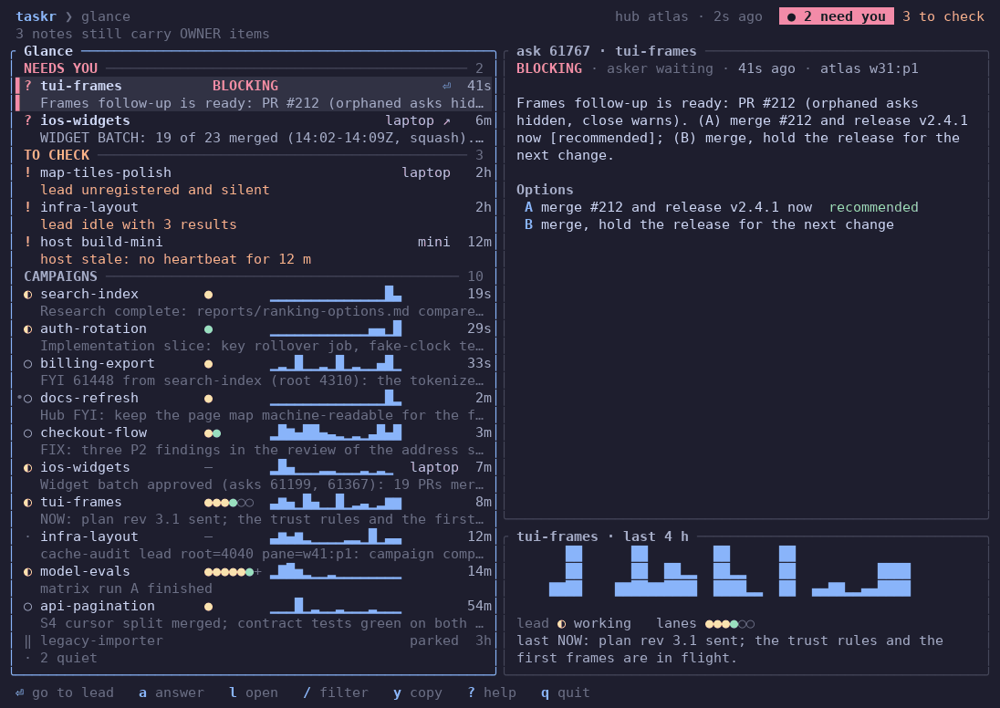
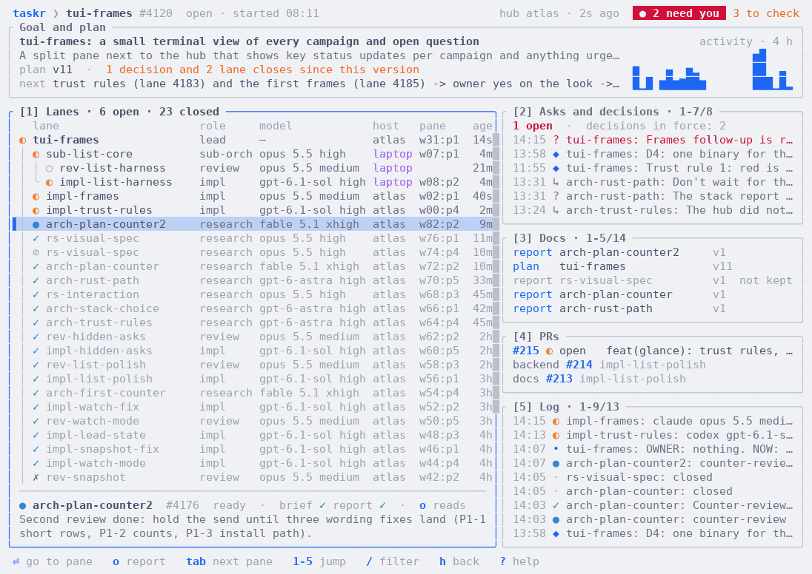

# taskr-tui: the owner's terminal view

`taskr-tui` shows the ledger in a terminal pane: what needs you first, then
every campaign. It reads through the `taskr` command, so it works on the hub
and on client hosts alike.

## Get it

There is no prebuilt download yet (one is planned). Build it from a clone of
this repository:

```sh
cargo install --path crates/taskr-tui
```

`rust-toolchain.toml` pins the Rust version; `rustup` installs it on first
use. `cargo build --release -p taskr-tui` leaves the binary in
`target/release/taskr-tui` if you prefer not to install it.

## Start it

```sh
taskr-tui            # your ledger
taskr-tui --demo     # invented data: no ledger is read, no key sends anything
```

| Option or variable | Effect |
| --- | --- |
| `--theme dark\|light\|terminal` | Pick the theme. Default: taken from the terminal's background. `TASKR_THEME` does the same. |
| `--ascii` | Draw with ASCII characters only. |
| `--demo` | Show invented data and write nothing. |
| `NO_COLOR` | Turn colour off. |
| `TASKR_BIN` | The `taskr` binary to read from. Default: `taskr` on `PATH`. |

It needs a terminal. In a script, `taskr glance` prints the same snapshot as
one line of JSON.

## Glance



The first screen has three sections, top to bottom:

- **Needs you:** open owner asks. Red always means an open owner ask and
  nothing else. `BLOCKING` marks an ask whose work has stopped for your answer.
- **To check:** things that may need a look but are not questions: a lead
  that went silent, a lead sitting on finished results, a host whose daemon
  stopped reporting. These are amber.
- **Campaigns:** every open campaign with its lead's state, one dot per
  lane, four hours of activity as a small graph, and its latest milestone.
  Quiet campaigns fold into one line at the bottom.

The header shows which hub the data comes from, how old it is, and the
verdict: **no owner action**, **N need you** or **N to check**. The pane on
the right shows the selected row in full. When its text is longer than the
pane, the title says which lines show (`9-34/34`): `tab` past the last
section, or a click, focuses the pane, and the keys below scroll it. In a
terminal under 100 columns there is no right pane; `a` shows an ask's full
text in the answer dialog, which scrolls with `ctrl-d` `ctrl-u` and `PgDn`
`PgUp`.

The view refreshes every five seconds. If the ledger stops answering, the
frame is marked stale and keeps the last data.

## Campaign



`l` on a campaign opens it. Five panes, numbered in their titles:

1. **Lanes:** the tree of workers under the lead, with role, model, host,
   pane and age. Closed lanes show their outcome.
2. **Asks and decisions:** open and answered questions, and the decisions in
   force.
3. **Docs:** captured briefs, reports, the goal and the plan. `o` reads one.
4. **PRs:** pull request references the campaign recorded.
5. **Log:** the newest events.

`c` on the glance lists every campaign, closed ones included.

## Keys

`?` shows this list in the view; it is the same table the code uses.

| Key | Does |
| --- | --- |
| `j` `k`, arrows | Down, up |
| `g` `G` | First, last row |
| `ctrl-d` `ctrl-u` | Half a page |
| `PgDn` `PgUp` | A page (the focused detail, a document, the answer dialog) |
| `tab`, `shift-tab` | Next or previous section, then the detail pane (glance), or pane (campaign) |
| `1`-`5` | Jump to a pane (campaign) |
| `Enter` | Go to the row's agent pane in Herdr |
| `l` | Open the campaign |
| `h`, `esc` | Back, close; from the detail pane, back to the list |
| `/` | Filter rows by name; search in a document |
| `c` | All campaigns, closed too (glance) |
| `a` | Answer the selected ask |
| `p` | Park or unpark a campaign (asks first) |
| `o` | Read the report or document |
| `y` | Copy the command that jumps to the row's pane |
| `r` | Refresh now |
| `m` | Mouse on or off |
| `t` | Theme: dark, light, terminal |
| `?` | Help |
| `q` | Close; quits on the glance |
| `space` | Page down (in a document) |

The mouse works too: click selects, double-click is `Enter`, the wheel
scrolls the pane under it.

With the glance's detail pane focused, `j` `k`, `g` `G`, `ctrl-d` `ctrl-u`
and `PgDn` `PgUp` scroll it instead of moving the cursor. Moving the cursor
starts the next row's detail at its top.

### What the keys change

Most keys only read. Three do more:

- **`Enter`** focuses the agent's pane. It works when `taskr-tui` runs in a
  Herdr pane and the agent's pane is on the same machine (the row shows `⏎`); for a pane on another machine (`↗`) use
  `y` to copy the command and run it there. Focusing moves every client
  attached to that Herdr server.
- **`a`** records your answer with `taskr answer`. If the ask lists options
  like `(A) ...; (B) ...`, the dialog offers them, and you can always write
  your own. When the asker is no longer waiting, the answer is also sent to
  its pane as a prompt.
- **`p`** parks a campaign (`taskr set ROOT glance.state=parked`) or unparks
  it. A parked campaign stays dim; its owner asks stay red.

## Marks

| Mark | Meaning |
| --- | --- |
| `?` | An owner ask |
| `!` | Something to check |
| `◐` | Working |
| `○` | Waiting |
| `●` | A lane; a ready lane |
| `·` | Idle |
| `×` | Gone |
| `‖` | Parked |
| `✓` `⊘` `✗` | Closed: done, abandoned, rejected |
| `⏎` `↗` | The pane is on this machine; on another |
| `•` | Changed since you last looked |

`--ascii` replaces these with plain characters.
